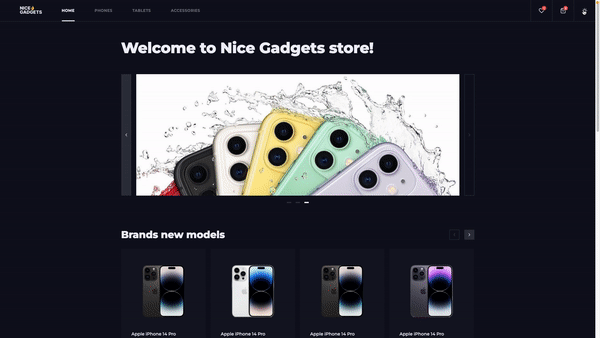
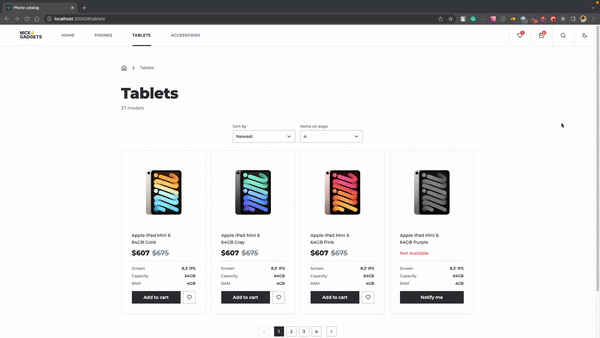
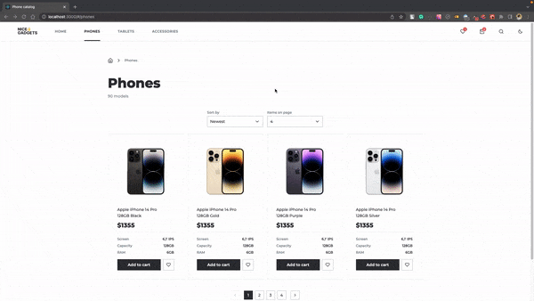

# Online gadgets store
A single-page application implements online store functionality. User can browse products, add them to the cart and favorites, search products, sort products, change the quantity of products in the cart, and view product details.

# [DEMO](https://anastaiia-tilikina.github.io/react_phone-catalog/)

# Table of contents
- [Technologies used](#technologies-used)
- [Structure](#structure)
- [Features & Functionality](#features--functionality)
- [Reflections](#reflections)

# Technologies used
- React.js
- React Router(v6)
- JSX
- TypeScript
- JavaScript
- LoDash
- Fetch, API
- Sass (SCSS)
- CSS Modules
- BEM methodology

# Structure
App is built using functional components and React Hooks.
Each component is abstract and fully reusable. Components are styled using Sass (SCSS) and CSS Modules (.env variable SASS_PATH added for utils import).
BEM methodology is used for naming and styling.

# Features & Functionality

## App 
- App is responsive and works on all screen sizes.
- Navigation is implemented using React Router.
- App is created in Dark and Light themes. User can switch between themes by clicking on the theme icon in the header. Theme is saved in the local storage.

## Home page
- Products sliders with the ability to scroll products by clicking on the arrows or dragging the slider (on Mobile devices). Sliders are responsive and change the number of products displayed depending on the screen size. Products are fetched from the server.

## Catalog pages
- Products are fetched from the server by category.
- Ability to sort products by name, price, and age is implemented.
- All sorting parameters are saved in the URL.

- Pagination is implemented. The number of products displayed on the page can be changed by the user.
- Search and filter products by name is implemented.
- Debounce function is used to prevent the server from being overloaded with requests.

## Product details page
- Product details are fetched from the server.
- User can pick a color and capacity of the product.
- Photos of the product can be changed by clicking on the thumbnails or by swiping them (on Mobile devices).
- User can add the product to the cart or favorites.
- If the product is not available or a few items are available, the user will see a message about it.

## Cart page
- User can change the quantity of products in the cart and remove products from the cart.
- Cart items count is shown near the Cart icon in the header.
- Total amount and quantity are calculated automatically.
- Cart items are saved in the local storage.

## Favorites page
- User can add products to favorites and remove them from favorites.
- Favorites count is shown near the Favorites icon in the header.
- Favorites are saved in the local storage.

## Reflections
Project goals included using technologies learned up until this point and familiarizing myself with documentation for new features.

One of the main challenges I ran into was using new Data router(v 6.6.1) (created via `createHashRouter` and rendered with `RouterProvider`) with new key features:
 - loaders
 - error boundaries
 - data prefetching
 - lazy loading
 - new hooks (useAsyncValue, useLoaderData, etc.)
 I had to learn how to use them and implement them in the project.

 Another challenge was to create 'pseudo' API. I've created my own data structure and written classes and methods to generate data for rendering and save them in `.json` files.

 At the end of the day, I've figured out how to work with bigger projects and how to use mentioned technologies all together.
