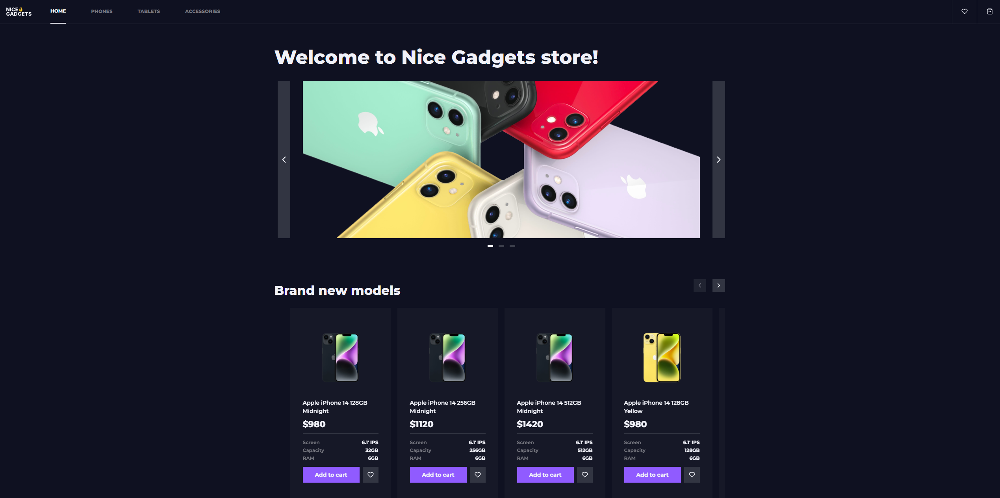

# 📱 React Phone Catalog

A modern, fully responsive phone catalog built with React, TypeScript, SCSS Modules, and React Router.
This project demonstrates advanced features like sorting, pagination, filtering, favorites, cart management with localStorage, and clean modular architecture.

## 📸 Screenshot



---

## 🚀 Features

- ⚛️ **Built with React & TypeScript**
- 📦 **Modular folder structure** with reusable components and module encapsulation
- 🛍️ Product listing with:
  - Sorting by age, title, price (`?sort=`)
  - Pagination (`?page=&perPage=`)
  - Search (`?query=`)
- 🧠 State management using React Context
- ❤️ Favorites and 🛒 Cart functionality (saved in localStorage)
- 💅 Smooth transitions, hover effects, and responsive layout
- 🧭 Fully functional routing with React Router
- 🖼️ Dynamic image sliders and product carousels
- 🧪 Fallback handling for Not Found pages and missing product details

---

Each component is placed in its own folder with:

- `index.ts` – barrel export
- `ComponentName.tsx` – logic & markup
- `ComponentName.module.scss` – scoped styling

---

## 🔗 Routing

| Path                  | Page                 |
| --------------------- | -------------------- |
| `/`                   | Home Page            |
| `/phones`             | Phones Page          |
| `/tablets`            | Tablets Page         |
| `/accessories`        | Accessories Page     |
| `/product/:productId` | Product Details Page |
| `/cart`               | Shopping Cart        |
| `/favorites`          | Favorites Page       |
| `*`                   | Not Found Page       |

---

## 🧩 Functionality Overview

### ✅ Home Page (`/`)

- Auto-switching image slider every 5s
- "Hot prices" carousel sorted by biggest discount
- Shop by category blocks with links
- Brand new block sorted by newest release year

### 📄 Products Page (`/phones`, `/tablets`, `/accessories`)

- Dynamic product list with:
  - Loader / error states / empty messages
  - Sorting (`Newest`, `Alphabetically`, `Cheapest`)
  - Pagination (`4 / 8 / 16 / All` items per page)

### 📱 Product Details Page (`/product/:productId`)

- Color & capacity selection
- Image gallery
- About & tech specs sections
- "You may also like" block with random suggestions
- Breadcrumbs & Back button navigation
- 404 handling if product not found

### 🛒 Shopping Cart Page (`/cart`)

- Add to cart / remove / adjust quantity
- Live total calculation
- Persistent cart in `localStorage`
- Checkout modal with clear/cancel option

### ❤️ Favorites Page (`/favorites`)

- Add/remove from favorites with heart icon
- Persistent favorites in `localStorage`

---

## 🎨 UI & UX

- Styled with SCSS Modules
- Smooth transitions on hover
- Sticky header and responsive footer with "Back to top"
- Fully accessible with ARIA labels and semantic HTML
- Responsive design

---

## 🧠 Advanced Features

- ✅ Debounced search input with live filtering
- ✅ Breadcrumb navigation
- ✅ Persistent state with `localStorage`
- ✅ URL-based state (sort, pagination, search)
- ✅ Not found handling for product and routes

---

## 🛠️ Installation & Setup

```bash
# 1. Clone the repo
git clone https://github.com/webEsperer/react_phone-catalog.git
cd react_phone-catalog

# 2. Install dependencies
npm install

# 3. Run the app
npm start
```
