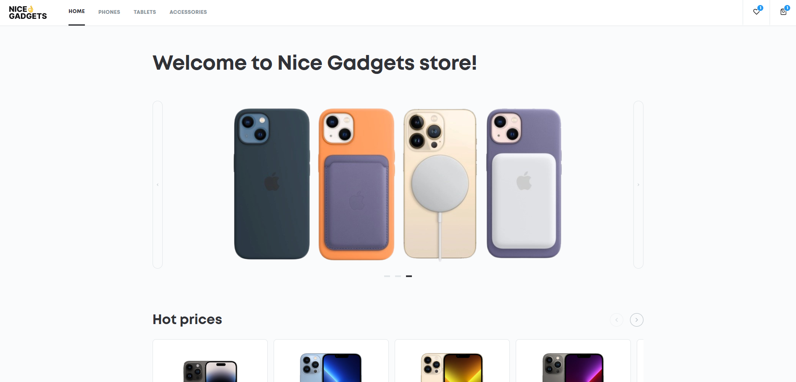

# Gadget Store (React + TypeScript)



## 🔗 Live Demo
### [👉 Click here to view the deployed application](https://kanezoor.github.io/react_phone-catalog/)

## 📝 Description
A modern, responsive e-commerce web application designed for browsing and purchasing tech gadgets (Phones, Tablets, Accessories).

This project was built to master **Modern React Patterns** and **TypeScript**. It moves beyond simple static pages to handle complex application state, such as managing a shopping cart, filtering product data in real-time, and ensuring type safety across components.

## 🛠 Technologies Used
* **Framework:** React.js (Functional Components & Hooks)
* **Language:** TypeScript
* **Styling:** CSS Modules / SCSS
* **Build Tool:** Vite
* **State Management:** React Context API / useState

## ✨ Key Features
* **🛒 Dynamic Shopping Cart:** Users can add/remove items, and the cart total calculates automatically.
* **🔍 Product Filtering:** Real-time filtering of gadgets by category (e.g., "Phones", "Accessories") and price range.
* **📱 Responsive Grid:** A product grid that adapts gracefully from mobile to desktop layouts.
* **Strict Typing:** All components and data models (e.g., `Product`, `CartItem`) are strictly typed with TypeScript interfaces to prevent runtime errors.

## 🚀 How to Run Locally
This project requires Node.js to be installed.

1. Clone the repository:
   ```bash
   git clone [https://github.com/Kanezoor/react_phone-catalog/tree/develop]
Navigate to the project folder:

Bash

cd [YOUR FOLDER NAME]
Install dependencies:

Bash

npm install
Start the development server:

Bash

npm run dev
🧠 What I Learned
TypeScript Integration: I learned how to define Interfaces for my data models (e.g., interface Product { id: number; price: number; ... }) and explicit types for Component Props, which significantly reduced bugs during development.

State Management: I gained experience handling complex state logic, such as syncing the shopping cart state between the Product List component and the Navbar component.

Component Reusability: I focused on building small, reusable components (like <ProductCard /> and <Button />) to keep the codebase clean and maintainable.

Array Methods: Heavily utilized .filter(), .map(), and .reduce() to handle product data and calculate totals.

<div align="center"> Created by <a href="https://github.com/Kanezoor">Vladyslav Kostiuk</a> </div>
